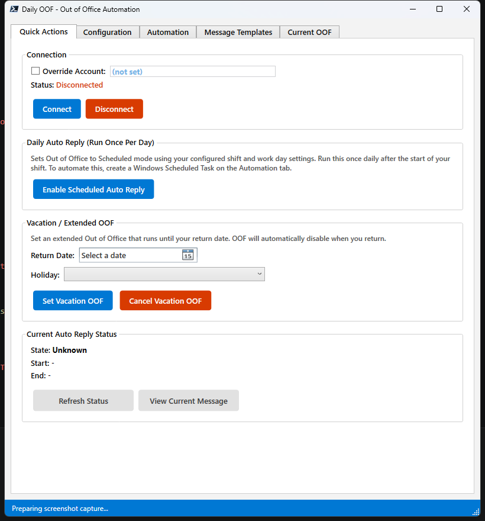
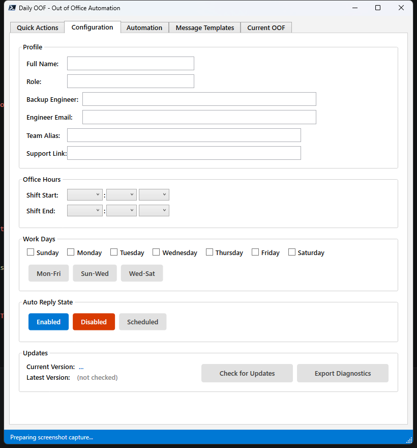
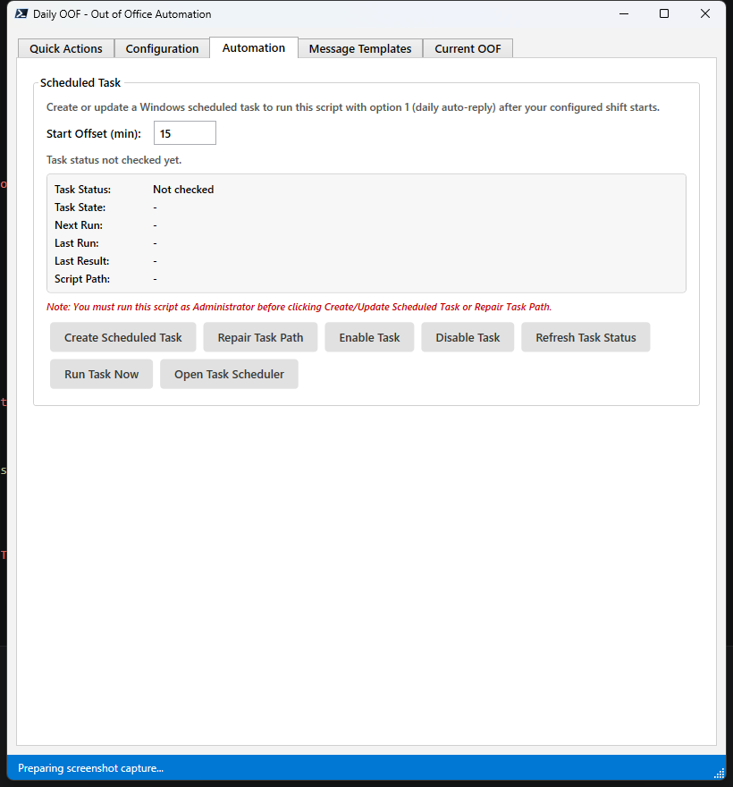
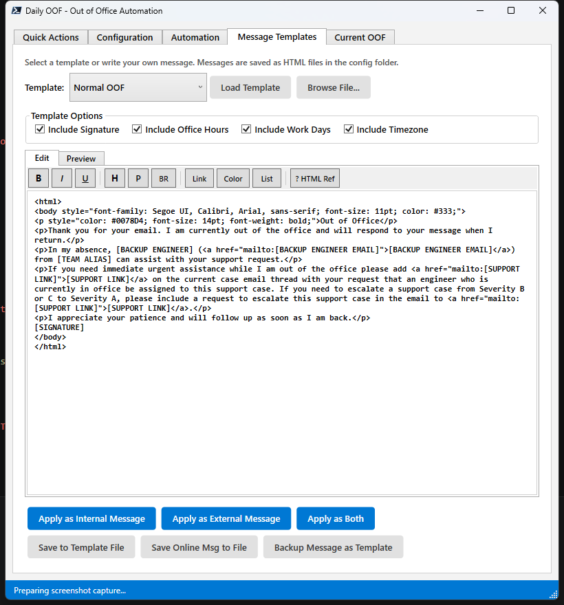
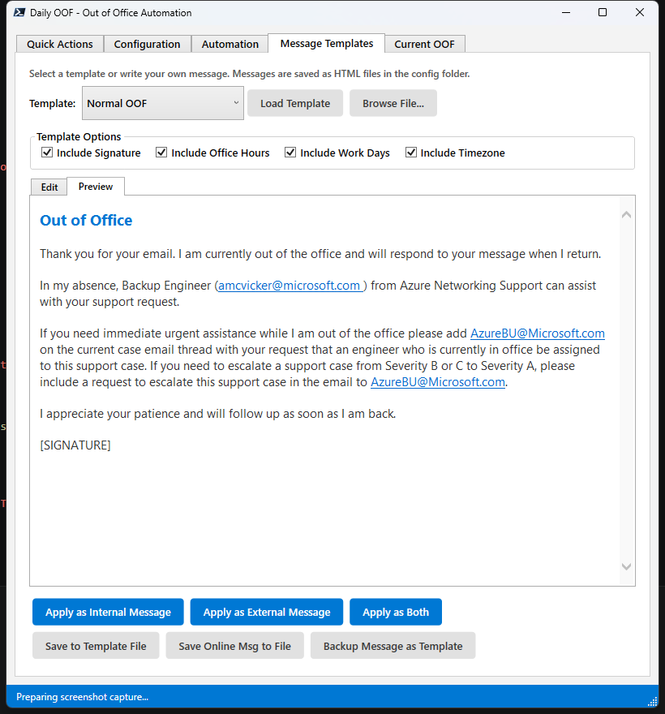
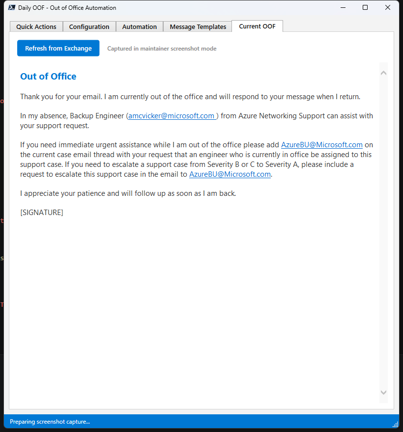
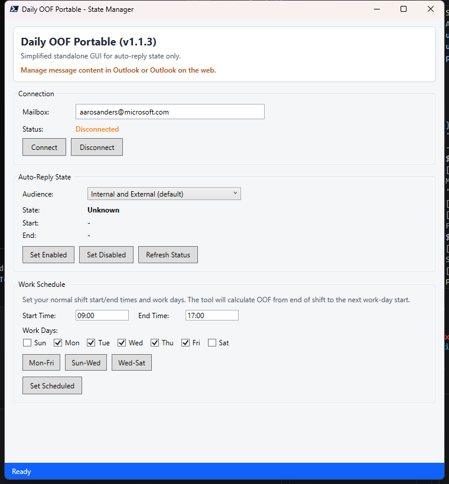

# Daily OOF — Out of Office Automation for Exchange Online

A PowerShell WPF GUI application that automates Exchange Online Out of Office (OOF) message management. Built for Azure Support Engineers but usable by anyone with an Exchange Online mailbox.

See [ROADMAP.md](ROADMAP.md) for the planned feature rollout and versioning strategy.

---

## Screenshots

> **Maintainer auto-capture:** Use the dedicated screenshot script to regenerate README screenshots without adding screenshot features to the end-user GUI flow.

```powershell
.\Capture-TabScreenshots.ps1

# Optional: keep the window open after capture for inspection
.\Capture-TabScreenshots.ps1 -KeepOpen
```

This script captures the app window for each major tab and writes PNG files into `screenshots/`.

### Quick Actions


### Configuration


### Automation


### Message Templates — Edit


### Message Templates — Preview


### Current OOF


### Portable


---

## Features

### Version Check Mode
Run the script with `-v` or `-version` to print the local script version and the latest version available on GitHub without opening the GUI:

```powershell
.\AAOOF-GUI.ps1 -v

# equivalent
.\AAOOF-GUI.ps1 -version
```

Typical output:

```text
Local version : v1.9.25
GitHub version: v1.9.25
```

This is useful for checking whether the file in your live folder or a copied script is up to date before launching the app.

### Current Settings and Message Mode
Run the script with `-CurrentSettingsInfo` to print the saved configuration plus the current live OOF state and message from Exchange Online without opening the GUI:

```powershell
.\AAOOF-GUI.ps1 -CurrentSettingsInfo

# aliases
.\AAOOF-GUI.ps1 -settings
.\AAOOF-GUI.ps1 -current-settings
```

This mode connects to Exchange Online, retrieves the current internal and external OOF messages, prints them to the console, and exits.

### GUI Mode
Launch the app with no arguments to open the full graphical interface:

```powershell
.\AAOOF-GUI.ps1
```

To check the downloaded file version before launching the GUI:

```powershell
& "$env:USERPROFILE\AAOOF-GUI.ps1" -v
```

### Portable Simplified Mode (Standalone)
Launch the standalone portable script for state-only management:

```powershell
.\AAOOF-Portable.ps1
```

Portable versioning is independent from the main GUI script. Current portable version: `1.1.2`.

Portable mode scope:
- Manages only auto-reply state (Enabled / Disabled / Scheduled)
- Does not include template editing or message apply flows
- Does not include scheduled task automation management
- Auto-detects the mailbox from your Windows login and email domain when possible
- Prompts to install the ExchangeOnlineManagement module if it is missing
- Supports work-day presets for common schedules such as Mon-Fri, Sun-Wed, and Wed-Sat when calculating the next scheduled auto-reply window
- Message content should be managed in Outlook or Outlook on the web

The GUI has five tabs:

---

#### Quick Actions
| Action | Description |
|---|---|
| **Connect / Disconnect** | Authenticate to Exchange Online using your alias. On connect, the app fetches your current OOF status. |
| **Enable Scheduled Auto Reply** | Sets OOF to *Scheduled* mode using your configured shift hours and work days. The start/end times are calculated automatically based on the current day. |
| **Set Vacation OOF** | Pick a return date and the app sets a *Scheduled* OOF that disables automatically when you return. |
| **Cancel Vacation OOF** | Immediately disables the vacation/extended OOF. |
| **Refresh Status** | Shows the current Auto Reply state, start time, and end time from Exchange Online. |
| **View Current Message** | Fetches the current OOF message from Exchange Online (auto-connects if needed) and displays it on the **Current OOF** tab. |

> **Tip — Use your own message from Outlook:** You don't have to compose your OOF message in this tool. You can create and format your Out of Office message directly in **Outlook** (or Outlook on the web) and simply use this tool to **schedule when** the message is active. The scheduling, vacation timing, and daily auto-reply features work independently of the message content. If you'd like to manage the message text as well, the **Message Templates** tab is available — but it's entirely optional.

---

#### Configuration
| Setting | Description |
|---|---|
| **Full Name** | Your display name for the auto-generated signature. Changes are saved and applied to templates immediately. |
| **Role** | Your job title, inserted into templates via the `[ROLE]` placeholder. If left blank, templates use "member of my team" instead. |
| **Backup Engineer** | Name or mailbox used by the `[BACKUP ENGINEER]` placeholder for escalation coverage. |
| **Engineer Email** | Email address of the backup engineer, used by the `[BACKUP ENGINEER EMAIL]` placeholder. |
| **Team Alias** | Team name or alias used by the `[TEAM ALIAS]` placeholder. |
| **Support Link** | URL used by the `[SUPPORT LINK]` placeholder in built-in templates. |
| **Email Suffix** | Your email domain suffix (default `@microsoft.com`). Combined with your Windows username to form the mailbox identity. |
| **Override Account** | Manually set your full email address instead of using auto-detection. |
| **Office Hours** | Start and end times for your shift (supports non-hour-boundary times like 8:30). Used for OOF scheduling and the signature's office-hours line. |
| **Work Days** | Select your working days (Sunday–Saturday). Preset buttons available: Mon–Fri, Sun–Wed (4×10), Wed–Sat (4×10). Days appear in the signature sorted by your work week (e.g., Wed–Sat starts with Wednesday). |
| **Auto Reply State** | Manually set OOF to Enabled, Disabled, or Scheduled. |
| **Check for Updates** | Downloads the latest script in a separate process and then prompts you to restart the app. |

#### Automation
| Setting | Description |
|---|---|
| **Scheduled Task** | Create or update the Windows Task Scheduler job used for daily automation. The UI shows task state, next run, last run, last result, target script path, and a summary status line. If the task points to the wrong script path, the summary calls it out. |
| **Task Offset** | Sets how many minutes after your shift start the daily scheduled task should run. |
| **Task Controls** | Run task now, refresh task status, open Task Scheduler, repair task path, and enable/disable the task directly from the Automation tab. |

---

#### Message Templates
Choose from four built-in HTML templates or load your own:

| Template | Description |
|---|---|
| **Normal OOF** | Standard out-of-office message (blue header) |
| **Vacation OOF** | Vacation message with `[RETURN DATE]` placeholder (green header) |
| **Sick OOF** | Unexpected absence / illness message (red header) |
| **Holiday OOF** | Company holiday message with `[RETURN DATE]` placeholder (amber header) |
| **Placeholder Examples** | Demo template showing all supported placeholders and how they resolve with your current config |

Templates auto-load when you change the dropdown selection. Before loading a different template, the current editor content is saved as a reusable HTML template (`last_message_template.html`) and appears in the template dropdown as **Last Loaded Message**.

##### Template Placeholders

You can use the following placeholders anywhere in your HTML templates. They are automatically replaced when a template is loaded:

| Placeholder | Resolves To |
|---|---|
| `[FULL NAME]` | Your display name (from Configuration, or derived from alias) |
| `[FIRST NAME]` | First name portion of your display name |
| `[LAST NAME]` | Last name portion of your display name |
| `[ROLE]` | Your configured role (falls back to "member of my team") |
| `[EMAIL]` | Your full email address |
| `[OFFICE HOURS]` | Your shift start – end times (e.g. "9:00 AM - 5:00 PM") |
| `[WORK DAYS]` | Your configured work days (e.g. "Monday, Tuesday, Wednesday") |
| `[TIMEZONE]` | Your local timezone display name |
| `[RETURN DATE]` | Selected return date from the date picker |
| `[HOLIDAY NAME]` | Selected holiday name from the holiday picker |
| `[BACKUP ENGINEER]` | Configured backup engineer from Configuration |
| `[BACKUP ENGINEER EMAIL]` | Configured backup engineer email address from Configuration |
| `[TEAM ALIAS]` | Configured team alias from Configuration |
| `[SUPPORT LINK]` | Configured support URL from Configuration |
| `[SIGNATURE]` | Auto-generated signature block (greeting, name, details, email) |

> If any placeholder remains unresolved when you click Apply, a warning dialog will list the issues before sending.

##### Template Options
A **Template Options** panel lets you toggle which dynamic content is injected into the `[SIGNATURE]` block:

| Option | Placeholder | Effect when unchecked |
|---|---|---|
| **Include Signature** | `[SIGNATURE]` | Removes the auto-generated signature block (name, details, email) |
| **Include Office Hours** | — | Removes your office hours from the signature block |
| **Include Work Days** | — | Removes your work days from the signature block |
| **Include Timezone** | — | Removes the timezone from the signature block |

> Toggling any option or changing the return date immediately re-renders the template in the editor and preview.

> **Signature note:** The signature is auto-generated from your Full Name field (or derived from your Windows username if blank). Because the auto-derived name is a best guess, **double-check that your name appears correctly** in the preview before applying, or enter your name in the Full Name field on the Configuration tab.

##### Edit & Preview
- **Edit tab** — View and hand-edit the raw HTML source
- **Preview tab** — Rendered HTML preview using a built-in browser control

##### Apply & Save
| Button | Description |
|---|---|
| **Apply as Internal Message** | Sets the message as the internal OOF reply |
| **Apply as External Message** | Sets the message as the external OOF reply |
| **Apply as Both** | Sets the message for both internal and external |
| **Save to Template File** | Overwrites the selected template file with the current editor content |
| **Save Online Msg to File** | Downloads the current live OOF message from Exchange Online and saves it locally |
| **Backup Message as Template** | Saves the current editor content as a new timestamped backup file (e.g. `backup_2026-04-19_14-30-00.html`) |

---

#### Current OOF
View your live auto-reply message as it appears to senders, rendered in an embedded browser control. The message is **automatically loaded** (with auto-connect if needed) the first time you switch to this tab.

| Action | Description |
|---|---|
| **Refresh** | Re-fetches the current OOF message from Exchange Online and renders it. Auto-reconnects if the session has expired. |
| **Status indicator** | Shows the current auto-reply state (Enabled / Disabled / Scheduled) and last-refreshed timestamp. |

---

### CLI Mode
For automation and scheduled tasks:

```powershell
# Show local and GitHub versions without opening the GUI
.\AAOOF-GUI.ps1 -v

# Show saved settings plus the current live OOF message without opening the GUI
.\AAOOF-GUI.ps1 -CurrentSettingsInfo

# Daily scheduled auto-reply (uses saved config)
# Skips if a vacation/extended OOF is active.
.\AAOOF-GUI.ps1 1

# Vacation mode until a specific date
.\AAOOF-GUI.ps1 '2026/04/14'
```

---

## Getting Started

### Prerequisites
- **PowerShell 5.1+** (Windows PowerShell) or **PowerShell 7+**
- **Exchange Online Management** module (prompted to install on first connect if missing)
- An Exchange Online mailbox

### Quick Download (no git required)

Download just the script file and let it auto-download the rest (XAML, templates) on first run.

#### Main GUI script

```powershell
# Download to your home directory
Invoke-WebRequest -Uri "https://raw.githubusercontent.com/MicrosoftAzureAaron/DailyOOF/main/AAOOF-GUI.ps1" -OutFile "$env:USERPROFILE\AAOOF-GUI.ps1"

# Then run it
& "$env:USERPROFILE\AAOOF-GUI.ps1"
```

Or download to a specific folder:

```powershell
Invoke-WebRequest -Uri "https://raw.githubusercontent.com/MicrosoftAzureAaron/DailyOOF/main/AAOOF-GUI.ps1" -OutFile "C:\tools\AAOOF-GUI.ps1"
& "C:\tools\AAOOF-GUI.ps1"
```

On first run the script creates a `config\` subfolder next to itself and downloads the XAML layout and all HTML templates automatically.

#### Standalone portable script

The portable script is fully self-contained — no `config\` folder or templates required.
It auto-fills your mailbox address when possible and prompts to install ExchangeOnlineManagement on first connect if needed.

```powershell
# Download to your home directory
Invoke-WebRequest -Uri "https://raw.githubusercontent.com/MicrosoftAzureAaron/DailyOOF/main/AAOOF-Portable.ps1" -OutFile "$env:USERPROFILE\AAOOF-Portable.ps1"

# Then run it
& "$env:USERPROFILE\AAOOF-Portable.ps1"
```

> **Tip:** If your execution policy blocks unsigned scripts, run this first:
> ```powershell
> Set-ExecutionPolicy -Scope CurrentUser -ExecutionPolicy RemoteSigned
> ```

---

### Installation (git clone)

```powershell
mkdir c:\tools
cd c:\tools
git clone https://github.com/MicrosoftAzureAaron/DailyOOF
cd DailyOOF
.\AAOOF-GUI.ps1
```

On first run the app downloads any missing config files (XAML, templates) from the repository automatically.

### Configuration Files

All configuration is stored in the `config/` folder:

| File | Purpose |
|---|---|
| `config.json` | User settings: shift times, work days, alias, name, role, suffix (gitignored) |
| `AAOOF-GUI.xaml` | WPF UI layout (auto-downloaded if missing) |
| `normal_oof.html` | Normal OOF template |
| `vacation_oof.html` | Vacation OOF template |
| `sick_oof.html` | Sick OOF template |
| `holiday_oof.html` | Holiday OOF template |
| `message.html` | Last-applied message (gitignored) |
| `last_message_template.html` | Last loaded editor message saved as a reusable template (gitignored) |

#### config.json Options

| Key | Type | Default | Description |
|---|---|---|---|
| `FullName` | string | *(auto-detected)* | Your display name for the signature |
| `Role` | string | `""` | Job title inserted via `[ROLE]` placeholder |
| `BackupEngineer` | string | `""` | Backup engineer used by `[BACKUP ENGINEER]` placeholder |
| `BackupEngineerEmail` | string | `""` | Backup engineer email used by `[BACKUP ENGINEER EMAIL]` placeholder |
| `TeamAlias` | string | `""` | Team alias used by `[TEAM ALIAS]` placeholder |
| `SupportLink` | string | `""` | Support URL used by `[SUPPORT LINK]` placeholder |
| `UserAlias` | string | *(auto-detected)* | Full email address for Exchange Online |
| `UserAliasSuffix` | string | `@microsoft.com` | Email domain suffix |
| `OverrideAccount` | bool | `false` | Use `UserAlias` as-is instead of auto-detecting |
| `StartOfShift` | datetime | — | Configured shift start time |
| `EndOfShift` | datetime | — | Configured shift end time |
| `WorkDays` | string[] | — | Array of working day names (e.g. `["Monday","Tuesday"]`) |
| `TaskStartOffsetMinutes` | int | `15` | How many minutes after shift start the daily scheduled task should run |

Additional files (gitignored):

| File | Purpose |
|---|---|
| `AutoReplyConfig.json` | Cached Exchange auto-reply config |
